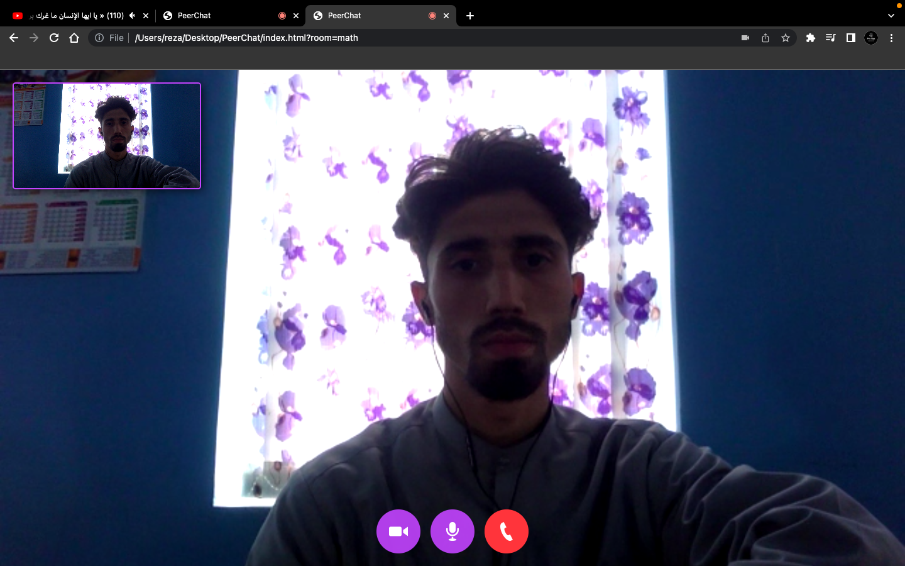

# VideoCall
VideoCall application with agora

# Installation
* 1 - clone repo https://github.com/RezaHabibi1001/videochat_agora
* 2 - Create an account on agora.io and create an app to generate an APP ID
* 3 - Update APP ID, Temp Token and Channel Name in main.js
```javascript
let APP_ID = "YOU-APP-ID"
```



